# Mizan — Security Posture, Measured.

<p align="center">
  <strong>A read-only observability layer over Microsoft Graph that scores every entity's security posture against a target, continuously.</strong>
</p>

<p align="center">
  <a href="https://portal.azure.com/#create/Microsoft.Template/uri/https%3A%2F%2Fraw.githubusercontent.com%2Fohomaidi%2FMizan%2Fmain%2Fweb%2Fdeploy%2Fazure-container-apps.json">
    
  </a>
  &nbsp;
  <a href="#macos">
    
  </a>
  &nbsp;
  <a href="#windows">
    
  </a>
</p>

<p align="center">
  
</p>

---

## What it does

Mizan pulls **18 read-only security signals** from every entity's Microsoft 365 tenant via Microsoft Graph, computes a per-entity **Maturity Index** (0–100), and ranks every entity against a target score you define. It's the one pane of glass for a holding company, ministry, or council that oversees dozens to hundreds of sub-organizations — each running their own tenant.

- **Federated visibility** across every consented Microsoft 365 tenant
- **18 Graph signals** — Secure Score, Conditional Access, Identity Protection, Intune compliance, Defender incidents, Purview DLP/IRM/Comm Compliance, Subject Rights Requests, retention/sensitivity labels, SharePoint tenant settings, PIM sprawl, Defender for Identity sensor health, Attack Simulation, Threat Intelligence, Advanced Hunting, label adoption
- **Pluggable frameworks** — UAE NESA, KSA NCA, ISR / ISO 27001, or generic
- **Entra ID sign-in + RBAC** — Admin / Analyst / Viewer, with configurable session timeouts
- **White-label** — organization name, logo (auto background-strip, 100% local), colors, tagline, framework — all in Settings
- **Bilingual** — full English + Arabic, RTL-native
- **Read-only, always** — never writes to an entity's tenant; no configuration push, no policy deployment

---

## Deploy

### <a name="azure"></a>🚀 Azure (recommended)

Click the button above. Azure portal opens with the template pre-loaded — fill in two fields and click Create.

Or via CLI:

```sh
az group create -n mizan-rg -l uaenorth
az deployment group create \
    -g mizan-rg \
    --template-file web/deploy/azure-container-apps.bicep \
    --parameters appBaseUrl=https://posture.example.com
```

After the deployment completes (~3 min), Azure prints the `dashboardUrl`. Visit it — the first-run setup wizard takes over from there.

**What gets provisioned:**
- Azure Container Apps managed environment + Container App (pulls the public image from ghcr.io — no registry setup on your side)
- Log Analytics workspace for app logs
- Storage account + Azure Files share for persistent SQLite + uploaded logos
- HTTPS ingress with auto-managed TLS

Cost: ~$25–40/month for a single-customer install (~200 entities).

---

### <a name="macos"></a>🖥 macOS

For on-prem labs, airgapped review stations, and demos.

```sh
git clone https://github.com/ohomaidi/Mizan.git
cd mizan
bash web/deploy/mac-build.sh
# Output: web/deploy/dist/mizan-<version>.pkg
```

Double-clicking the `.pkg` on the target Mac:

- Drops the app at `/usr/local/mizan/`
- Installs a LaunchAgent that starts it on login (http://localhost:8787)
- Creates `~/Library/Application Support/mizan/` for the SQLite DB + uploaded logos
- Writes `~/Desktop/mizan-CREDENTIALS.txt` with first-run instructions — auto-opens when the installer finishes

---

### <a name="windows"></a>🪟 Windows

For on-prem government desktops.

```powershell
git clone https://github.com/ohomaidi/Mizan.git
cd mizan
powershell -File web/deploy/windows-build.ps1
# Output: web\deploy\dist\mizan-<version>.msi
```

Double-clicking the `.msi`:

- Installs to `C:\Program Files\Mizan\`
- Registers "Mizan" Windows Service (starts on boot)
- Creates `%ProgramData%\Mizan\data\` for SQLite + uploaded logos
- Adds a Desktop shortcut → http://localhost:8787

---

## First-run setup

Every install drops the operator on a 5-step setup wizard at `/setup`:

| Step | What it captures |
|---|---|
| 1 | Organization name (EN + AR), short form, framework (NESA / NCA / ISR / Generic) |
| 2 | Logo upload — background auto-removed locally via a bundled U-2-Netp ONNX model (no cloud, no Python) |
| 3 | Graph-signals Entra app (multi-tenant, for reading posture) |
| 4 | User sign-in Entra app (single-tenant, for staff sign-in) |
| 5 | Bootstrap admin — the first account to complete sign-in is promoted to admin automatically |

Steps 2–5 are all skippable — configure them from Settings anytime.

<p align="center">
  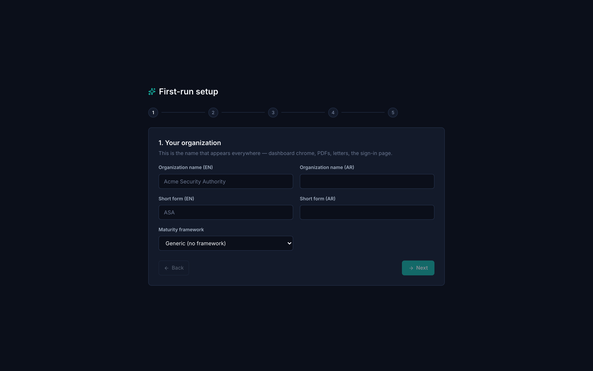
</p>

---

## Screenshots

### Maturity overview — the morning glance
Every connected entity ranked against your target, KPI tiles for the whole estate, 7d/30d/QTD/YTD deltas. One screen tells you who's dragging and who's pulling away.

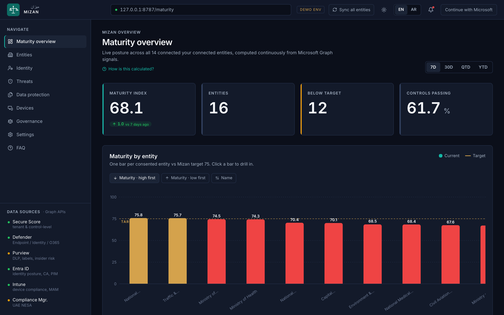

### Connected entities
Full list, sortable by any column. Cluster chips (Police / Health / Edu / Municipality / Utilities / Transport / Other) filter in place. CSV export one click away.

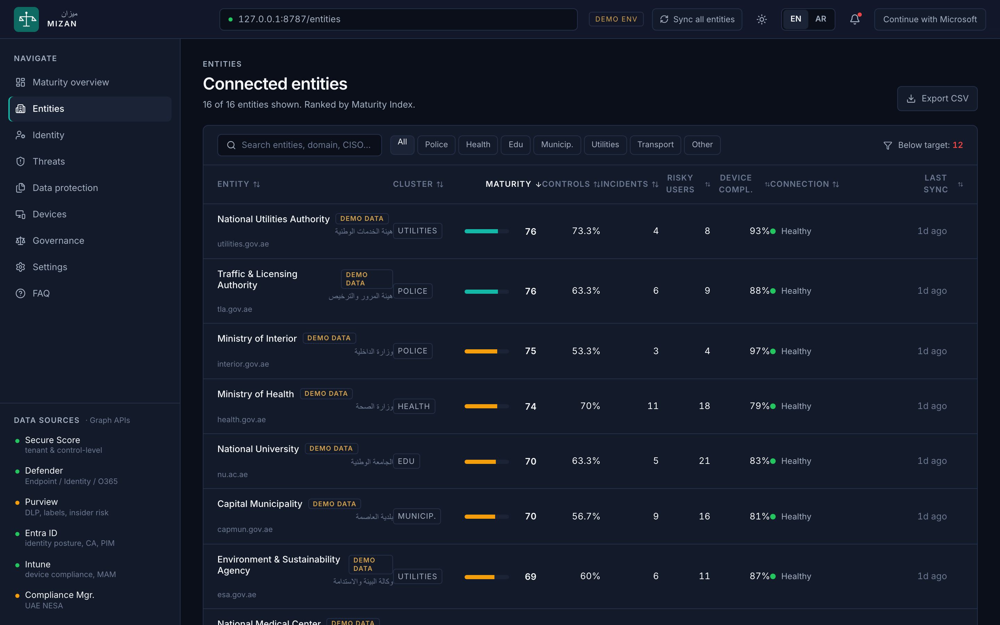

### Entity drill-down
Per-entity Maturity Index with sub-score breakdown (identity, device, data, threat, compliance). Controls tab for dragging Secure Score items, Incidents tab for active Defender alerts, Connection tab for sync health.

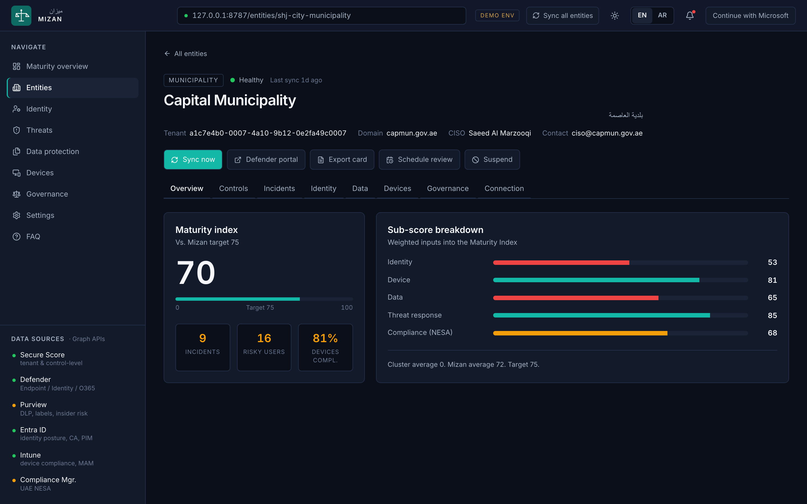

### Governance — framework alignment
UAE NESA alignment by default. Switch to KSA NCA, ISR / ISO 27001, or generic at install time. Per-clause coverage bars backed by real Secure Score control mappings.

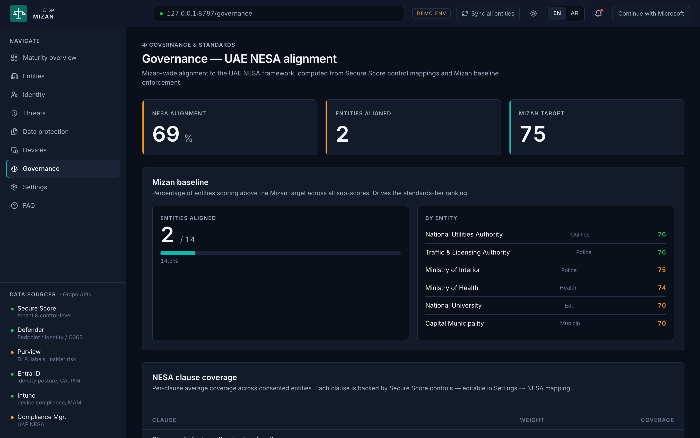

### Data protection, identity posture, threats, devices
Roll-up views for the cross-entity security story.

<p align="center">
  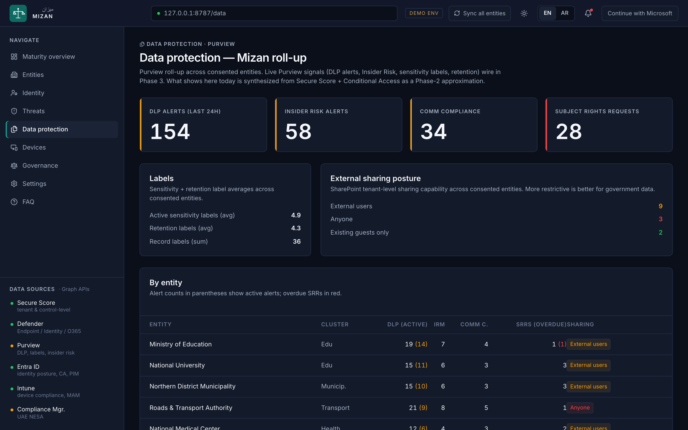
  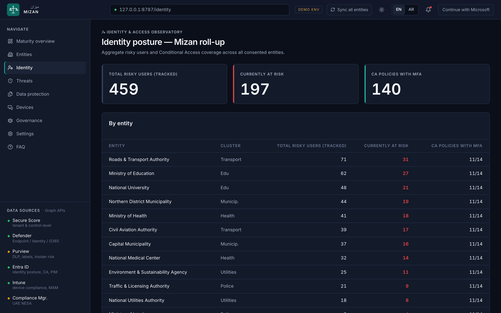
</p>
<p align="center">
  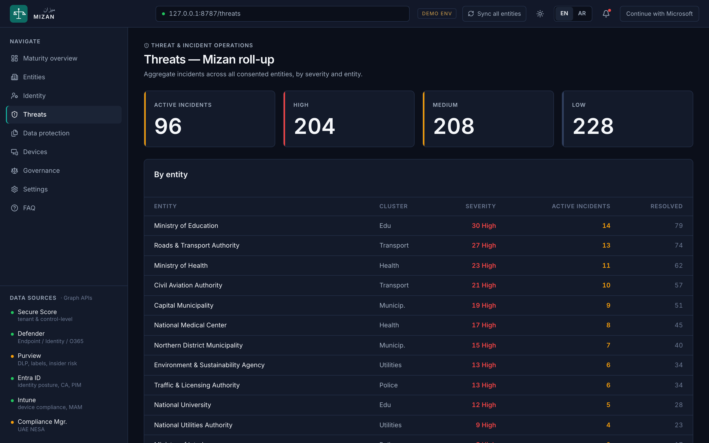
  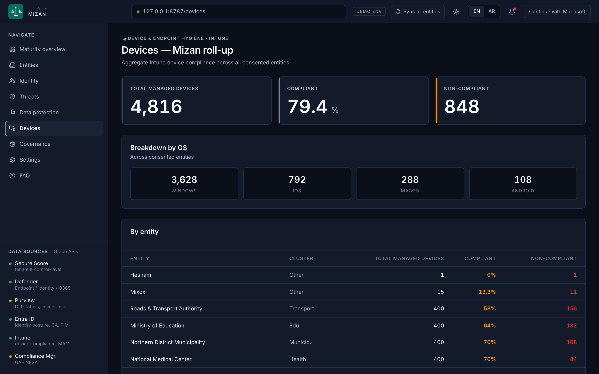
</p>

### Branded sign-in + user management
Entra ID sign-in, Admin / Analyst / Viewer roles, invite-by-email. All gated behind the in-app **Enforce sign-in** toggle so first-run installs stay open until you're ready.

<p align="center">
  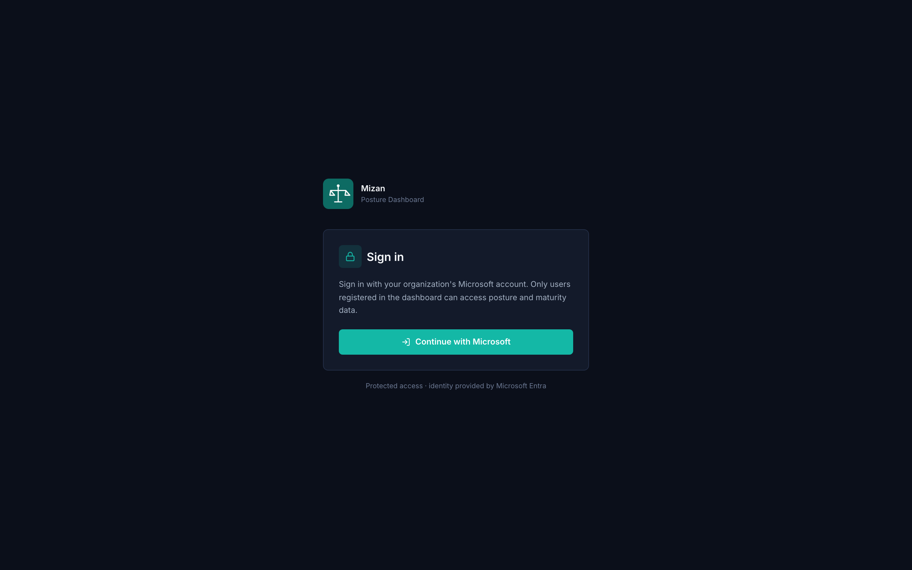
  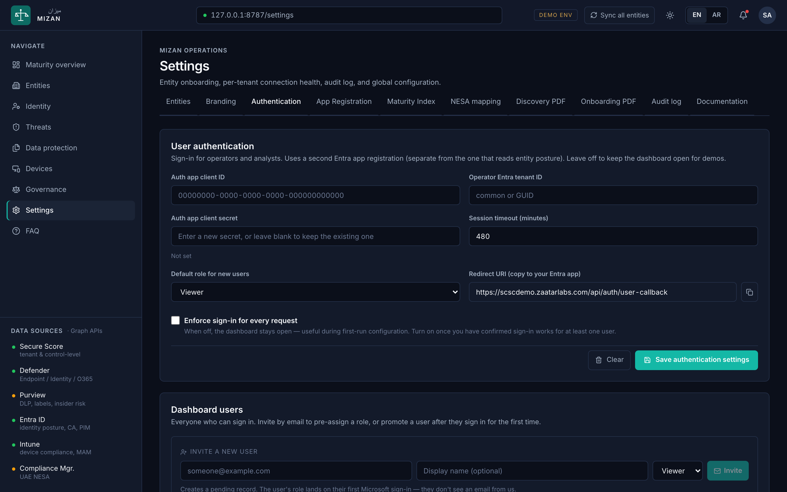
</p>

### White-label branding in 30 seconds
Name (EN + AR), short form, tagline, colors, framework. Upload a logo and the ML model auto-strips the background locally.

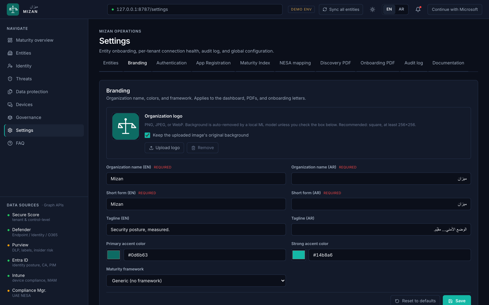

---

## Architecture at a glance

```
┌────────────────────────────────────────────────────────────┐
│  Mizan host (ACA container / Mac LaunchAgent / Windows svc) │
│  ┌────────────────┐   ┌────────────────┐                    │
│  │   Next.js      │──▶│  SQLite        │  ← DATA_DIR mount  │
│  │   app router   │   │  (signals,     │                    │
│  └───────┬────────┘   │   users,       │                    │
│          │            │   config)      │                    │
│          ▼            └────────────────┘                    │
│    sync orchestrator                                        │
│    + 5-worker pool                                          │
└──────────┬─────────────────────────────────────────────────┘
           │ Microsoft Graph (read-only, daily)
           ▼
     ┌─────────────────────────────────────────┐
     │  Each connected entity's M365 tenant    │
     │  (consented the multi-tenant Graph app) │
     └─────────────────────────────────────────┘
```

- **Daily sync**: one `POST /api/sync` per day pulls all 18 signals from every consented entity with a 5-worker concurrency pool.
- **Snapshots**: every signal-fetch writes a timestamped row into `signal_snapshots` so week-over-week deltas + 90-day trend lines are cheap.
- **No write path**: ever. All Graph permissions are `.Read` scopes.

See [docs/04-architecture-and-risks.md](docs/04-architecture-and-risks.md) for the full breakdown.

---

## Documentation

- [docs/10-deployment.md](docs/10-deployment.md) — end-to-end deployment runbook (all three targets)
- [docs/11-branding-and-rbac.md](docs/11-branding-and-rbac.md) — branding config, RBAC model, session management
- [docs/08-phase2-setup.md](docs/08-phase2-setup.md) — Entra app registrations (both apps), app roles, lockout recovery
- [docs/01-feature-catalog.md](docs/01-feature-catalog.md) — full feature inventory
- [docs/04-architecture-and-risks.md](docs/04-architecture-and-risks.md) — multi-tenant auth, sync orchestrator, throttling, failure modes
- [docs/09-runtime-configuration.md](docs/09-runtime-configuration.md) — every editable config surface in Settings
- [CHANGELOG.md](CHANGELOG.md) — build log

---

## License

MIT. See [LICENSE](LICENSE).

Built on [Microsoft Graph](https://learn.microsoft.com/en-us/graph/), [Next.js](https://nextjs.org/), [better-sqlite3](https://github.com/WiseLibs/better-sqlite3), [ONNX Runtime](https://onnxruntime.ai/), [sharp](https://sharp.pixelplumbing.com/), [@react-pdf](https://react-pdf.org/).
